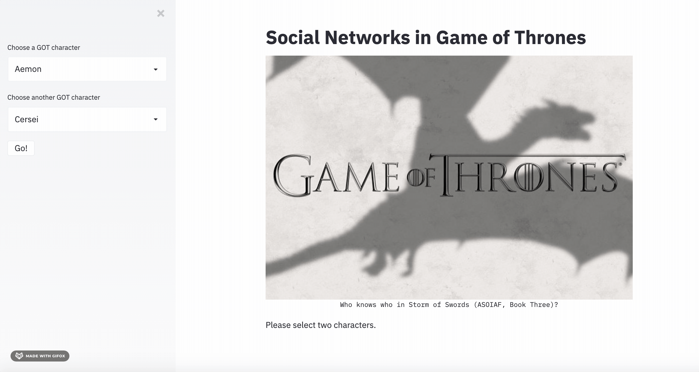

# Social Networks in Game of Thrones	

During quarantine I decided to hit up the book shelf and read George RR Martin's [*A Song of Ice and Fire* series](https://georgerrmartin.com/book-category/?cat=song-of-ice-and-fire). The story is famously composed such that characters are "scattered geographically and enmeshed in their own social circles," yet are all related to each other in some way.

I created a simulation of a graph database using Python and SQL to discover 1st, 2nd, and 3rd-Degree Networks between any two GOT characters. Characters are said to be related if they are mentioned within 15 words of each other in  *A Storm of Swords*, the third novel in *ASOIAF*. If the latter is true, then it is highly probable that the characters are either appearing in the same scene or talking about each other, which constitutes a relation in this simulation. 

## Demo

Samwell Tarly and Cersei Lannister:

## Data & Methodology

Nodes: 107; unimodal

Edges: 353; undirected

I used Python, MySQL, and Graphiz to create 1st, 2nd, and 3rd-Degree networks for a pair of characters that may show how they know each other in the world of ASOIAF. That is,

- 1st-Degree: do the two characters know each other?

#### (s:Person {id:character1}) - [r:APPEARED] - (t:Person {id: character2})

- 2nd-Degree: who are the two characters' mutual friends (or enemies)?

#### (s:Person {id:character1}) - [r:APPEARED*2] - (t:Person {id: character2})

- 3rd-Degree: which characters appear with 2nd-Degree connections?

#### (s:Person {id:character1}) - [r:APPEARED*3] - (t:Person {id: character2})

I used streamlit to visualize the graphs for any pair of 107 characters. That means my program can generate about 11,342 different graphs (not counting 1-node graphs, like Cersei-Cersei or Tyrion-Tyrion). 

### More Example Graphs

Jon Snow and Margaery Tyrell:

Daenerys Targaryen and Cersei Lannister:

### ASOIAF

A quick summary of the story by [Beveridge and Shan](https://www.maa.org/sites/default/files/pdf/Mathhorizons/NetworkofThrones%20%281%29.pdf):

>The narrative starts at a time of peace, with all the houses unified under the rule of King Robert Baratheon, who holds the Iron Throne...[Then King Robert dies and all heck breaks loose.]

>Driven by cause or circumstance, characters from the many noble families launch into arduous and intertwined journeys. Among these houses are the honorable Stark family (Eddard, Catelyn, Robb, Sansa, Arya, Bran, and Jon Snow), the pompous Lannisters (Tywin, Jaime, Cersei, Tyrion, and Joffrey), the slighted Baratheons (led by Robert’s brother Stannis) and the exiled Daenerys, the last of the once powerful House Targaryen.

### Credits

This data was originally compiled by [A. Beveridge and J. Shan, "Network of Thrones," Math Horizons Magazine , Vol. 23, No. 4 (2016), pp. 18-22](https://www.maa.org/sites/default/files/pdf/Mathhorizons/NetworkofThrones%20%281%29.pdf).

I used the data from melaniewalsh's repository, sample-social-network-datasets. 

